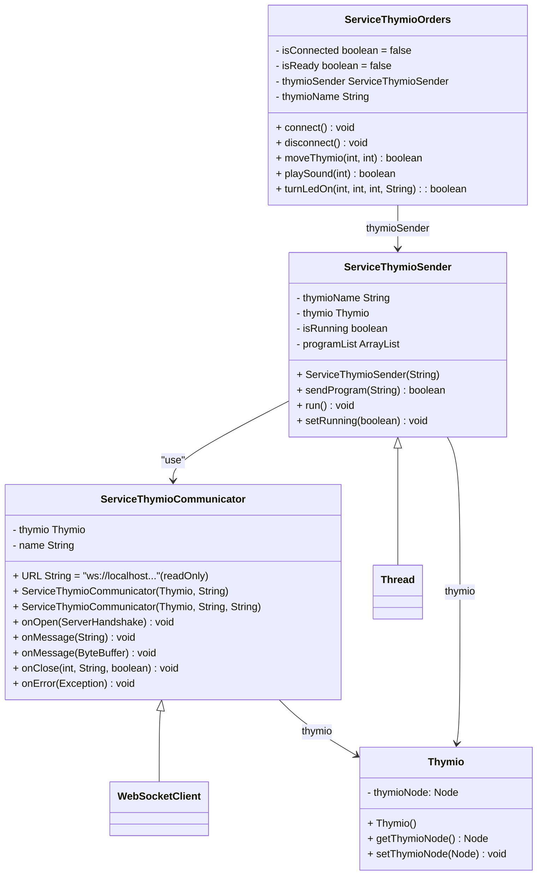

# EMFThymioJava
## Table des matières

1. [ThymioJavaConnect QESAKO?](#thymiojavaconnect-qesako)
2. [Préparation et utilisation de la librairie](#préparation-et-utilisation-de-la-librairie)
    1. [Installer Thymio Suite](#installer-thymio-suite)
    2. [Vérifier que l'on puisse se connecter au Thymio](#vérifier-que-lon-puisse-se-connecter-au-thymio)
    3. [Vérifier que tout fonctionne](#vérifier-que-tout-fonctionne)
3. [Diagramme de classes](#diagramme-de-classes)
4. [Exemples d'utilisation](#exemples-dutilisation)
    1. [Exemple 1 - Se connecter](#exemple-1---se-connecter)
    2. [Exemple 2 - Se déconnecter](#exemple-2---se-déconnecter)
    3. [Exemple 3 - Bouger le Thymio](#exemple-3---bouger-le-thymio)
    4. [Exemple 4 - Jouer un son](#exemple-4---jouer-un-son)
    5. [Exemple 5 - Allumer une led](#exemple-5---allumer-une-led)
    6. [Exemple 6 - Un projet fonctionnel](#exemple-6---un-projet-fonctionnel)
5. [Réaliser votre projet](#réaliser-votre-projet)


## ThymioJavaConnect QESAKO?
**ThymioJavaConnect** est le résultat de la réalisation d'un TPI de fin d'apprentissage permettant d'utiliser **Thymio** avec Java. Le but de cette librairie est de mettre en place une solution qui permet d'être utilisée lors des modules de développement lors d'apprentissages à l'**EMF**. Cette librairie est permet pour l'instant l'envoi d'ordres mais pas encore la récupération des données des capteurs. Voici un liste résumant toutes les actions possible avec cette librairie via l'application **Thymio Suite** :
- Se connecter au Thymio
- Se déconnecter au Thymio
- Piloter le Thymio
- Demander au Thymio de jouer un son
- Allumer une led du Thymio

Au niveau matériel, il faut un **Thymio** qui peut être connecté à un ordinateur avec un câble ou alors avec un dongle USB.
Au niveau logicel, l'application **Thymio Suite** doit être installée et démarée pour pouvoir communiquer avec le **Thymio**. La libairie présente dans ce projet est aussi nécéssaire.

## Préparation et utilisation de la librairie
### Installer Thymio Suite
Pour commencer à utiliser la librairie **ThymioJavaConnect**, il est nécéssaire d'installer l'application **Thymio Suite**. Cette application est un logiciel freeware qui peut être trouvée et téléchagé sous [Thymio Suite](https://www.thymio.org). Après avoir téléchargé ce logicel, il ne reste plus qu'a suivre l'installation et le logicel est prêt.
### Vérifier que l'on puisse se connecter au Thymio
Pour vérifier que la connexion avec le **Thymio** soit possible, il faut commencer par connecter le Thymio avec l'ordinateur (possible avec le dongle ou avec un cable USB) et l'allumer (en appuyant sur le bouton au milieu). Une fois que c'est fait, il ne reste plus qu'à ouvrir l'application **Thymio Suite** et en appuyant sur l'icone d'un des languages de programmation et vérifier que le nom du **Thymio** soit écrit.
### Vérifier que tout fonctionne
Pour préparer, et vérifier que tout fonctionne, il faut d'abord [vérifer si la connexion est disponible au Thymio](#vérifier-que-lon-puisse-se-connecter-au-thymio) puis ensuite ajouter la librairie [**Thymio_Java_Connect**](https://github.com/emf-info/EMFThymioJava/tree/main/dist) (C'est le fichier .jar ;-)) dans votre projet java. Attention cette librairie nécéssite l'utilisation de 3 autres librairies qui peuvent être trouvées dans [le dossier lib de ce repos](https://github.com/emf-info/EMFThymioJava/tree/main/lib). Et maintenant tout est prêt !!!
## Diagramme de classes
Dans ce diagramme, on peut y retrouver 3 classes principales. Premièrement la classe ServiceThymioOrders qui va permettre d'envoyer des ordres au Thymio (c'est celle que l'on va utiliser). Puis on peut voir la classe ServiceThymioSender, cette classe s'occupe d'envoyer les ordres tant que l'on est connecté. Et pour finir, on peut retrouver la classe ServiceThymioCommunicator qui va recevoir les message de la communication asynchrone avec Thymio Suite. Voici le diagramme :

## Exemples d'utilisation
Dans les points ci-dessous, des exemples d'utilisation pour se connecter, se déconnecter, bouger le **Thymio** ou encore lui demander de jouer un son ou d'allumer une led seront montrés. Pour plus d'informations sur les méthodes veuillez vous référencer à la [javadoc](https://github.com/emf-info-tpi/23-24-ThymioJavaConnect/tree/main/dist/javadoc)
### Exemple 1 - Se connecter
Pour se connecter au Thymio, il suffit d'utiliser la méthode connect de la classe ServiceThymioOrders. Attention la connexion peut prendre un petit peu de temps (5 secondes puis timeout) donc n'allez pas trop vite. Voici un exemple :
```Java
//Création d'une instance
ServiceThymioOrders thymio = new ServiceThymioOrders();
//Thymio EMF1 doit être remplacé par le nom de votre Thymio
String nom = "Thymio EMF1":
thymio.connect(name);
```
### Exemple 2 - Se déconnecter
Maintenant que nous nous sommes connectés, il nous faut aussi pouvoir nous déconnecter. Pour pouvoir se déconnecter, il suffit d'utiliser la méthode disconnect de la classe ServiceThymioOrders. Voyez ici un exemple :
```Java
//thymio est l'instance du ServiceThymioOrders créée précédemment
try{
    thymio.disconnect();
} catch (InterruptedException ex) {
    System.out.println("Problème à l'interruption du Thread permettant la communication avec le Thymio");
}
```
### Exemple 3 - Bouger le Thymio
Se connecter et se déconnecter ce n'est pas tout, il est aussi possible de faire bouger le Thymio en utilisant la méthode moveThymio de notre classe ServiceThymioOrders. Voyez l'exemple ci-dessous :
```Java
//thymio est l'instance du ServiceThymioOrders créée précédemment. ok vaut true si l'ordre à bien été envoyé false si l'ordre n'a pas été envoyé.
//Ici les valeurs possibles pour la vitesse de chaque moteur se trouve entre -500 et 500 compris.
//Thymio avance tout droit à vitesse max
int moteurGauche = 500;
int moteurDroite = 500;
boolean ok = thymio.moveThymio(moteurGauche, moteurDroite);
```
### Exemple 4 - Jouer un son
Thymio nous permet aussi de jouer un son. Pour se faire, il faut utiliser la méthode playSound de la classe ServiceThymioOrders. Voici un exemple :
```Java
//thymio est l'instance du ServiceThymioOrders créée précédemment. ok vaut true si l'ordre à bien été envoyé false si l'ordre n'a pas été envoyé.
//Ici les valeurs possibles pour la fréquence sont entre 16 et 20'000 compris.
//Thymio joue un son à une fréquence de 1000Hz
int frequence = 1000;
boolean ok = thymio.playSound(frequence);
```
### Exemple 5 - Allumer une led
Pour finir il est aussi possible d'allumer une des leds du Thymio. Pour les allumer il faut utiliser la méthode turnLedOn de la classe ServiceThymioOrders. Voici l'exemple :
```Java
//thymio est l'instance du ServiceThymioOrders créée précédemment. ok vaut true si l'ordre à bien été envoyé false si l'ordre n'a pas été envoyé.
//Ici les valeurs possibles pour red,green et blue sont entre 0 et 32 tandis que pour led les valeurs possibles sont top pour la led du haut, bottom.left pour la led bas gauche et bottom.right pour la led bottom bas droite
//Thymio allume la led du haut en rouge
int red = 32;
int green = 0;
int blue = 0;
String led = "top";
boolean ok = thymio.turnLedOn(red,green,blue,led);
```
### Exemple 6 - Un projet fonctionnel
Bien que les exemples soit très simples, une application de démonstration est disponible dans [ce repos GitHub](https://github.com/emf-info-tpi/23-24-ThymioJavaConnect/tree/main). Cette application permet de controller le Thymio avec une manette de Xbox. Voici une image qui montre à quoi cette application ressemble :


## Réaliser votre projet
A votre tour de vous amuser et de créer un projet fantastique! Faites libre cours à votre imagination
